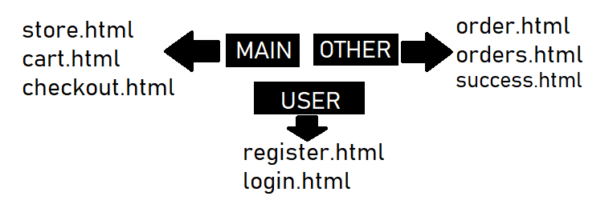
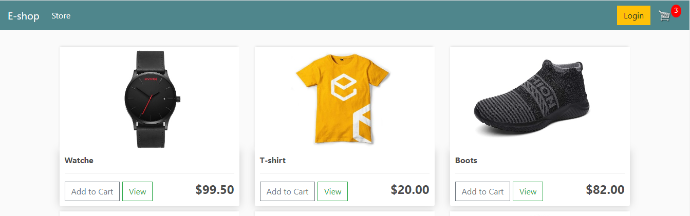
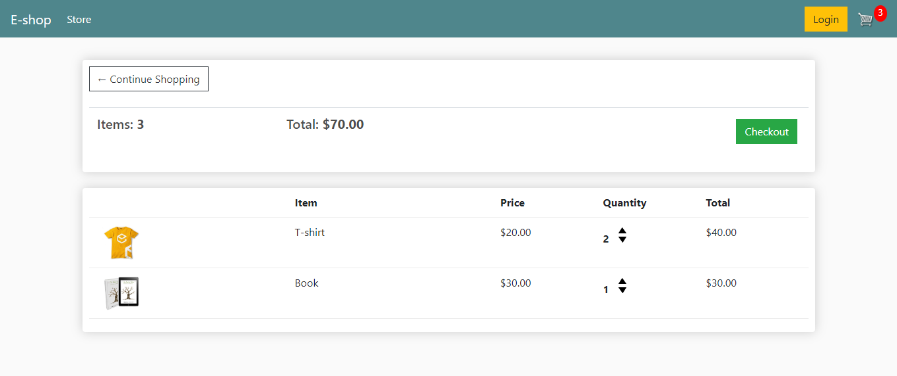
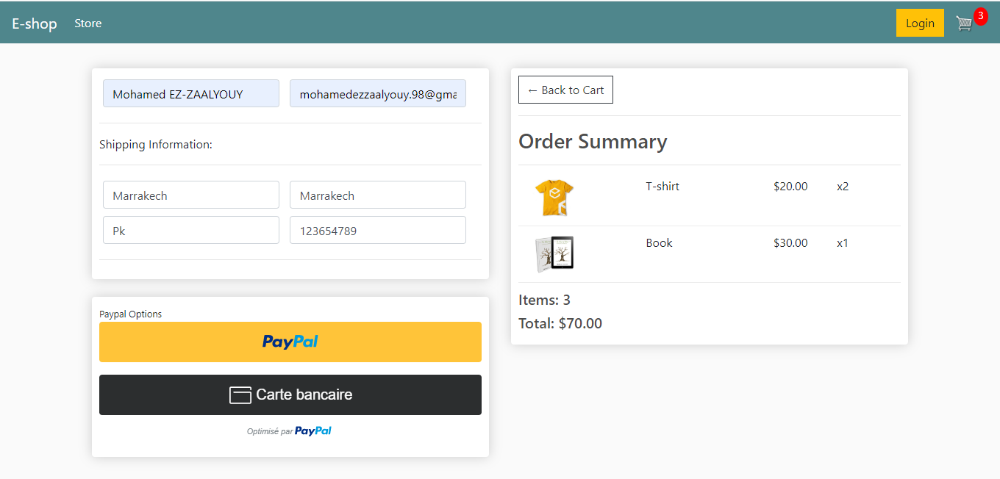

# Project Overview

This project will be a fully functional eCommerece website with user and guest checkout capabilities.

We will start first by setting up our templates and data structure, then moving on to adding user checkout flow with payment integration.

After we complete basic checkout with a logged in user, we will add in the ability for users to checkout as a guest using cookies

# Project Structure

Before we start building, let's go over the core structure of this project. I’ll first go over templates and what each one will handle and then we’ll cover our models and page functionality.

## Templates

This project will focus on 3 main templates, store.html, cart.html and checkout.html.

# What We Building

### Store.html

This product will be a fully functioning eCommerce website from start to checkout functionality. Users will have the ability to add multiple products to cart, varying from physical to digital products.

## Payment Integration

### Cart.html

### Checkout.html

Payment integration will be handled with PayPal offering the ability to checkout with a PayPal account and checkout with PayPal debit/credit card. Stripe integration is simple to add but for the purpose of international transactions we will focus on PayPal for international availability and security.

# Models

#### Before running this project you need intall below list apps and packages

Install Python 3.7 or above -> https://www.python.org/

Install Pip -> python get-pip.py

pip install Django

pip install Pillow

#### For running

python manage.py runserver
