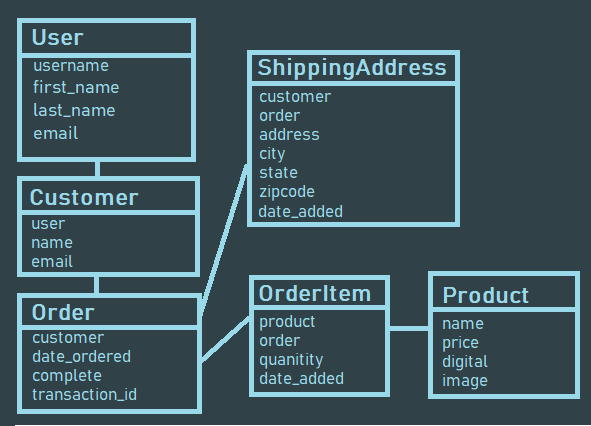

# Project Overview

This project will be a fully functional eCommerece website with user and guest checkout capabilities.

We will start first by setting up our templates and data structure, then moving on to adding user checkout flow with payment integration.

After we complete basic checkout with a logged in user, we will add in the ability for users to checkout as a guest using cookies

# Models

#### Before running this project you need intall below list apps and packages

Install Python 3.7 or above -> https://www.python.org/

Install Pip -> python get-pip.py

pip install Django

pip install Pillow

#### For running

python manage.py runserver
